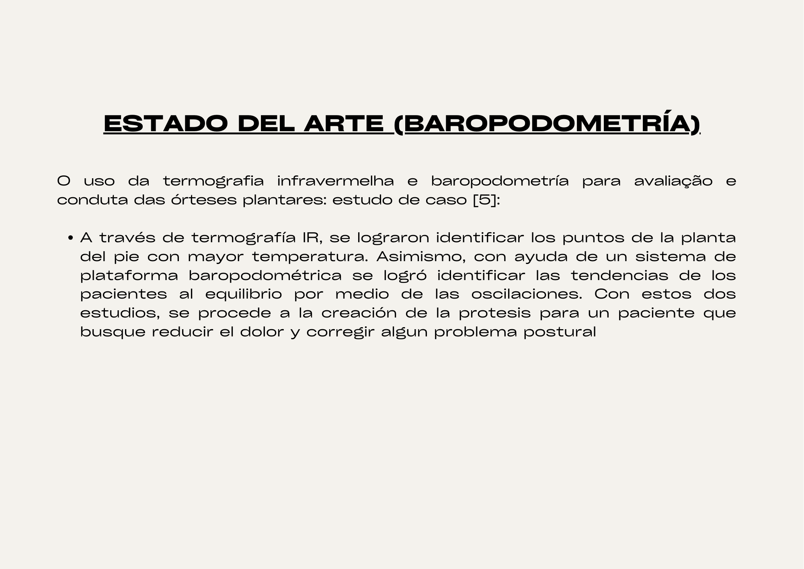
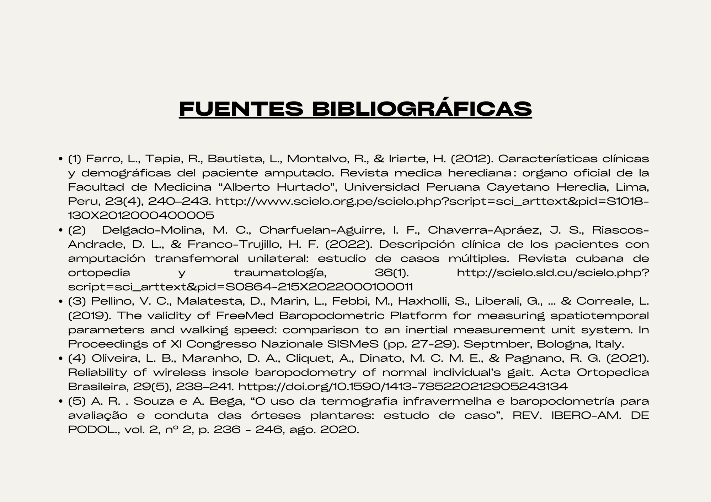

**Datos Clave del caso:**

muñón cilíndrico, tejido celular subcutáneo pesado, musculatura media, contractura de psoas, rango articular limitado a extensión. Miembro contralateral: hipotrofia muscular, cicatriz en cara posterior medial. Rangos articulares conservados, contractura de gemelos. Fuerza muscular 3+. AC: independiente hasta (4 puntos) posición de gateo.

**1. Definiciones de términos clave:**

* Muñón: parte de un miembro que ha sido amputado

* Hipotrofia muscular: Debilitamiento debido a la disminución de músculo

**2. Análisis de la temática y/o caso:**

2.1 **Contexto en el Perú**

Este estudio descriptivo, retrospectivo y transversal se llevó a cabo en pacientes del área de Amputados del Instituto Nacional de Rehabilitación "Adriana Rebaza Flores" en Lima-Callao, Perú, entre 2002 y 2007. Se incluyeron 570 pacientes, pero solo 331 historias clínicas (58,1%) contenían datos completos sobre la condición socioeconómica. La edad promedio de los pacientes fue de 43,11 ± 21,55 años (rango: 1 a 93 años). Los pacientes mayores de 40 años presentaron mayor frecuencia de amputaciones por causas no traumáticas (principalmente vasculares), mientras que en los menores de 40 años predominaron las amputaciones traumáticas. (tabla 1).

El 78,1% de las amputaciones afectaron al miembro inferior, con un 53,9% de amputaciones por encima de la rodilla. Las causas traumáticas y no traumáticas fueron similares en frecuencia, destacando la angiopatía diabética como la principal causa no traumática (42,3%). (tabla 2)

Las amputaciones no traumáticas fueron más comunes por encima de la rodilla (p < 0,01), mientras que las traumáticas se observaron más en el grupo de ≤ 40 años (p < 0,001). En Lima-Callao, las amputaciones de causa no traumática fueron más frecuentes (p = 0,001). (tabla 3)

[http://www.scielo.org.pe/scielo.php?script=sci_arttext&pid=S1018-130X2012000400005](http://www.scielo.org.pe/scielo.php?script=sci_arttext&pid=S1018-130X2012000400005)

2.2 **Contexto mundial**

A nivel mundial, la amputación se considera un problema de salud pública. Para crear programas y políticas destinados a prevenir la amputación y mejorar la salud de los afectados, es crucial conocer su epidemiología.

La mayoría de los participantes son hombres (88%), mientras que solo el 12% son mujeres. En cuanto a la ocupación, un 34,7% de los encuestados tienen ocupaciones elementales, seguido de un 22,7% que son jubilados, y un 13,3% que se dedican a oficios mecánicos y otros trabajos artesanales. Respecto a la distribución geográfica, la mayor parte de los participantes provienen de las comunas de Cerro Navia (20%), Pudahuel (18,7%), y Quinta Normal (17,3%).

Este cuadro muestra que la mayoría de las amputaciones son unilaterales, siendo la derecha más común (53,3%), especialmente las transtibiales (42,6%). Las amputaciones bilaterales son menos frecuentes (12%). La diabetes es la principal causa de amputación (85,3%), seguida por causas traumáticas (5,3%).

El 92% de los pacientes recibió intervenciones de rehabilitación. La mayoría usa silla de ruedas para movilizarse (78,7%), y el 86,6% postuló a SENADIS para adquirir prótesis. Solo el 5,3% obtuvo la prótesis de manera particular. En cuanto a la reinserción laboral, solo el 14,7% logró reinsertarse, mientras que el 70,6% no tiene licencia médica. por

Cuadro médico

<table>
  <tr>
    <td>Prevención</td>
    <td>Diagnóstico</td>
    <td>Tratamiento </td>
    <td>Monitoreo</td>
  </tr>
  <tr>
    <td>-Implementar estrategias para mejorar la rapidez de respuesta de las ambulancias en situaciones críticas, garantizando una atención oportuna y efectiva.

-Asegurar un seguimiento constante y adecuado de los niveles de glucosa en personas con diabetes mellitus para prevenir complicaciones graves, asimismo mejorar la educación de la paciente respecto a su condición.
</td>
    <td>-Posibilidad de uso de prótesis

-Cesáreas
previas en dos oportunidades

-Diabetes mellitus hace 5 años aprox.
Medicación: metformina 850mg.

-Miembro inferior izquierdo con amputación transversal
arriba de rodilla AK F2

-Discapacidad de cuidado personal: dificultad de desplazarse a la ducha

-Discapacidad de Locomoción:
Caminar
Salvar desniveles
Subir escaleras

-Se indica confección de prótesis definitiva

</td>
    <td>-Se prescribe terapia física,
ocupacional, psicología y servicio social.

-Requiere
realizar entrenamiento de actividades de la vida diaria con pilón de yeso.

</td>
    <td>Terminó ciclo
de entrenamiento en terapia física, se entrena con pilón en paralelas, se enseña patrón de marcha, presenta equilibrio deficiente, logra salir fuera de paralelas con andador.

No ha realizado terapia ocupacional por falta de cupos. Acudió a servicio social y psicología. 

Se prescribe continuar con entrenamiento en terapia física y ocupacional y se indica confección de prótesis definitiva
</td>
  </tr>
</table>

Diagrama de Ishikawa:

**3. Definición del Problema**

Falta de  prótesis en el Perú para la amputación transversal arriba de rodilla AK F2 para personas de mayor edad que necesitan habilidades motoras más específicas y que requieren mayor esfuerzo físico y tiempo para acostumbrarse a la protesis por la edad . (ejem subir gradas, mantener el equilibrio en la ducha, subir rampas, etc).

**4. Estado del Arte-Contexto Científico:**

Una prótesis transfemoral, como su nombre indica, se utiliza cuando el paciente ha sufrido una amputación por encima de la rodilla. Estas prótesis cubren la mayor parte de la pierna y, por lo tanto, incluyen dos articulaciones. También se les conoce como prótesis por encima de la rodilla y están compuestas por cuatro componentes principales.

* Encaje

* Articulación de rodilla 

* Pierna

* Conjunto pie-tobillo

En el mercado hay una amplia variedad de componentes para prótesis transfemorales. Al prescribir una prótesis, el protesista debe seleccionar y combinar estos componentes de manera que la prótesis funcione de la mejor manera posible y satisfaga las necesidades del paciente. A continuación, se presenta un diagrama con los principales componentes de una prótesis transfemoral, junto con una breve explicación de cada uno.

1.  **Encaje**

El encaje o socket es el componente que conecta al paciente con la prótesis y permite la transmisión del peso del cuerpo hacia el suelo a través de toda la prótesis. Su forma es crucial para garantizar el confort y la funcionalidad, ya que debe ajustarse perfectamente al muñón sin comprometer la circulación ni quedar demasiado flojo. En el caso de las prótesis transfemorales, el encaje generalmente cubre todo el muñón. Su diseño debe aprovechar los músculos del muñón para controlar la prótesis y transmitir el peso del amputado hacia el suelo.

Los encajes suelen ser fabricados de plástico rígido, aunque también existen encajes flexibles con soporte rígido que mejoran el confort al caminar y al sentarse. Para mantener el encaje en su lugar, se emplean dos técnicas principales: la succión, que crea un vacío entre el muñón y la superficie interna del encaje, y un cinturón, que se ajusta alrededor de la cadera del paciente, una técnica más antigua.

2. **Pierna**

Este componente tiene la función de conectar la articulación de la rodilla con el tobillo y es responsable de transmitir las fuerzas generadas por el peso del paciente hacia el suelo.

3. **Pie-Tobillo **

Este componente incluye la articulación del tobillo y se clasifica en dos tipos: articulados y no articulados. Los tobillos articulados permiten movimiento y se subdividen según el rango de movimiento que ofrecen, con opciones de eje único y eje múltiple. Los tobillos de eje múltiple proporcionan mayor flexibilidad y mejor estabilidad al caminar sobre superficies irregulares. Por otro lado, los tobillos no articulados, como el "SACH Foot", son más simples y están diseñados para funciones básicas.

4)** Rodilla**

El sistema de la rodilla es probablemente el componente más complejo de una prótesis. Su función es proporcionar soporte al paciente cuando está de pie, facilitar una marcha natural y suave, y permitir que la persona se siente. Actualmente, existen más de 100 tipos de rodillas protésicas disponibles, que van desde sistemas tradicionales hasta los más avanzados tecnológicamente. Para elegir el sistema de rodilla más adecuado para cada paciente, los doctores, protesistas y especialistas en rehabilitación deben considerar factores como la edad del amputado, su estado de salud, el nivel de actividad y su estilo de vida. Entre los más de 100 tipos de rodillas, se destacan dos categorías principales: las rodillas mecánicas y las computarizadas.

* **4.1 Rodillas mecánicas **

**_Rodillas de eje simple_**

Estas rodillas funcionan de manera similar a una bisagra, permitiendo únicamente la flexión y extensión. Entre sus características más importantes se encuentran:

-Al ser muy sencillas duran mucho tiempo y son muy ligeras 

-Son las rodillas más baratas

-No cuentan con control de apoyo, lo que significa que el amputado debe de mantenerse estable utilizando sus propios músculos 

-Usualmente cuentan con un seguro manual para compensar la falta de control de apoyo 

-Utilizan fricción para evitar que la pierna se mueva muy rápido durante el balanceo, es decir cuando el amputado da el paso

**_Rodillas policéntricas (eje múltiple) _**
Son más complejas que las anteriores y brindan más libertad de movimiento al paciente. Algunas características son:

-Deben de ser reparadas o reemplazadas más seguido que otro tipo de rodillas protésicas 

-Pesan más que las anteriores 

- Son muy estables en el comienzo del paso 

- Reducen el largo de la pierna al comienzo del paso, lo que disminuye el riesgo de tambalearse e incluso caerse 

-Se doblan durante la fase de balanceo, es decir cuando una pierna no esta en contacto con el suelo; de igual forma se doblan permitiendo que el paciente se siente 

-Funcionan en la mayoría de los amputados, pueden ser usadas con muñón largo, en amputación bilateral y desarticulación de rodilla. 

-Cuentan con control simple de balanceo lo que permite una velocidad ideal al caminar 

-Ocasionalmente cuentan con control de balanceo por fluido (aceite o aire) que permite variar la velocidad de la marcha 

-Pueden llegar a restringir algunos movimientos de la rodilla, sin llegar a causar problemas

En las rodillas mecánicas existen dos opciones diferentes con las cuales se puede obtener estabilidad. Estos son: 

**_Rodilla con seguro manua_**l: 

Este tipo de rodillas son las más estables ya que se bloquean automáticamente en la extensión. El seguro puede quitarse con facilidad, sin embargo, si este no es removido se necesita mucha energía para caminar y provoca una marcha rara. Puede ser utilizada por pacientes débiles y por aquellos que caminan en superficies disparejas.

**_Rodilla con control de apoyo activado por el peso:_**

Estas rodillas son muy estables, ya que durante la fase de balanceo aplican constantemente fricción al eje. Son muy seguras ya que si el cuerpo de la persona está sobre la prótesis la rodilla no se dobla. Este tipo de rodillas son generalmente las primeras que utilizan los amputados o son usadas por aquellos pacientes de mayor edad o con nivel de actividad menor. 

*Control de movimiento *

Todos los sistemas de rodilla deben de contar con algún tipo de control en la fase de balanceo, esto es para que la marcha de la persona sea correcta y estable. Las opciones que existen son: Fricción constante y fricción variable

**_Fricción constante:_**

 Estos sistemas son simples, de bajo peso, seguras y solo pueden ser ajustadas a una velocidad de marcha al mismo tiempo. Es decir, si el paciente quiere correr después de haber caminado es necesario que la ajuste antes de que lo pueda hacer. 

**_Fricción variable: _**

Este tipo de sistemas van incrementando la resistencia mientras la rodilla va flexionándose desde la extensión completa, permiten diferentes velocidades al caminar, necesitan con mayor frecuencia ajustes y el cambio de las partes con movimiento. Aunque su funcionamiento es parecido o similar a los sistemas con control de balanceo por fluido, se considera que su diseño es menos avanzado.

**_Sistemas de control de balanceo por fluido _**

Estos sistemas funcionan gracias a un pistón dentro de un cilindro que da diferentes grados de resistencia durante el balanceo, permitiendo que los amputados caminen a diferentes velocidades cómodamente. Existen dos tipos de sistemas con este control, estos son; 

**_Control neumático: _**

Utilizan cilindros neumáticos que proveen energía para que la articulación pueda extender y flexionar. Pueden contar con un resorte para dar mayor control a la marcha dando mayor control que los sistemas de fricción y en algunas ocasiones son considerados menos efectivos que los sistemas hidráulicos. 

**                              **

**               **

**                                control de balanceo por control neumático**

**_Control hidráulico: _**

Utilizan aceite de silicón para responder a un amplio rango de velocidades durante la marcha. Permiten una funcionalidad muy cercana a la articulación normal. Sin embargo, estos sistemas son más pesados, necesitan mayor mantenimiento y tienen un costo más elevado que los sistemas neumáticos. Pacientes con niveles altos de actividad usualmente usan este tipo de sistemas.

* **4.2 Rodillas computarizadas**

Esta tecnología en rodillas protésicas es relativamente nueva y sigue en constante evolución. En el mercado hay diversos tipos de rodillas computarizadas, y su desarrollo continúa avanzando. Aunque cada modelo tiene sus particularidades, todas comparten las siguientes características:

Usualmente son más pequeñas y menos pesadas que las rodillas mecánicas ?? Son programadas para aprender el modo de caminar del usuario.

-Cuentan con sensores de balanceo, tiempo y fuerza con capacidad de leer información unas 50 veces por segundo o más y ajustan al sistema de control de fluido inmediatamente después de que las lecturas fueron tomadas

- El esfuerzo es menor para el amputado, lo que deriva en una marcha más natural, permiten que el paciente camine por más tiempo y cuentan con mayor control en superficies disparejas 

-Estas prótesis pueden ser usadas por pacientes con un nivel de actividad moderado hasta pacientes con niveles altos de actividad.

**Pies protésicos avanzados:**

 **  - Pie de carbono:** Como el **1C60 Triton de Otto Bock**, diseñado para una amplia gama de actividades, desde el deporte hasta las tareas diarias. Estos pies destacan por su dinámica y estabilidad, acumulando y liberando energía durante el ciclo de la marcha.

 **  - PROPRIO FOOT:** Este pie inteligente es capaz de responder de manera automática a cambios en el terreno, facilitando actividades cotidianas como subir escaleras o caminar en superficies irregulares. Su función de flexión de tobillo ajusta el ángulo de forma natural, mejorando la estabilidad y reduciendo la fatiga.

  ** - Pies con EVO (Optimización del Vector de Energía):** Incorporados en modelos como el **LP Vari-Flex** y **Re-Flex Rotate** de Össur, estos pies optimizan el contacto con el suelo, lo que se traduce en una marcha más natural y menos tensión en la pierna sana y la espalda.

   **- Pies multiarticulares y de un solo eje:** Los pies multiarticulares son recomendados para personas muy activas debido a su capacidad para adaptarse a tres direcciones de movimiento, mientras que los pies de un solo eje ofrecen un movimiento más limitado pero controlado, con topes de goma ajustables.

Bibliografia.

1) Puglisi, L., & Moreno, H. (2006). Protesis roboticas. *Revista del Departamento de Automática e Informática Industrial*, 1-2. 
[https://d1wqtxts1xzle7.cloudfront.net/31882711/Protesis_roboticas-libre.pdf?1391545651=&response-content-disposition=inline%3B+filename%3DResumen_En_este_articulo_se_hace_una_rev.pdf&Expires=1724989976&Signature=ZKJXCZjQIZHHZRoA0huEioAXc-D00ePyRw862FMiXvxPmDceZbYqubH8~XPXtDl90PjuqZmNKwK752tP7kr5hpwhaGnRYU0vrnplTVuXKJ4JCJslYjSc5GozFqya3i9gaXW4sysmKHhFT4FstbQXrCYSh1bH4ZJfrm7-yCFRwyLeaKJd~8hEZuR0o5x377g7ywPqce68iKS2z9WiogQuc-RQ-hNvGlHmgRf9FQRdVcH9Ho5aT3dQVB9BYQ5Th4WYGsTNzGCAhCdkLBAkJj~Q4c7oFShbH4pSLmq7OpNEQmA~Ac3viIn5q6oZ1GiAba9lFD~xfd4XBtU~eWKv1buP8w__&Key-Pair-Id=APKAJLOHF5GGSLRBV4ZA](https://d1wqtxts1xzle7.cloudfront.net/31882711/Protesis_roboticas-libre.pdf?1391545651=&response-content-disposition=inline%3B+filename%3DResumen_En_este_articulo_se_hace_una_rev.pdf&Expires=1724989976&Signature=ZKJXCZjQIZHHZRoA0huEioAXc-D00ePyRw862FMiXvxPmDceZbYqubH8~XPXtDl90PjuqZmNKwK752tP7kr5hpwhaGnRYU0vrnplTVuXKJ4JCJslYjSc5GozFqya3i9gaXW4sysmKHhFT4FstbQXrCYSh1bH4ZJfrm7-yCFRwyLeaKJd~8hEZuR0o5x377g7ywPqce68iKS2z9WiogQuc-RQ-hNvGlHmgRf9FQRdVcH9Ho5aT3dQVB9BYQ5Th4WYGsTNzGCAhCdkLBAkJj~Q4c7oFShbH4pSLmq7OpNEQmA~Ac3viIn5q6oZ1GiAba9lFD~xfd4XBtU~eWKv1buP8w__&Key-Pair-Id=APKAJLOHF5GGSLRBV4ZA)

2) GONZÁLEZ, I. H. (2023). *Diseño y control avanzado de una Prótesis Activa de Extremidad Inferior* (Doctoral dissertation, INSTITUTO POLITÉCNICO NACIONAL).

[https://www.ctrl.cinvestav.mx/~yuw/pdf/DoTesIvan.pdf](https://www.ctrl.cinvestav.mx/~yuw/pdf/DoTesIvan.pdf)

3) Ascencio Sepulveda, Ó. J., Gómez Baquero, D. J., Espejo Mora, A. M., & Martín Gómez, P. F. (2007). Diseño y modelamiento de pie para prótesis transfemoral con sistema de amortiguación. *Epsilon*, *1*(9), 7-18.
[https://ciencia.lasalle.edu.co/ep/vol1/iss9/2/](https://ciencia.lasalle.edu.co/ep/vol1/iss9/2/)

4) Espejo Mora, A. M. (2007). Construcción de un prototipo final de pie para prótesis transfemoral.

[https://ciencia.lasalle.edu.co/cgi/viewcontent.cgi?article=1129&context=ing_automatizacion](https://ciencia.lasalle.edu.co/cgi/viewcontent.cgi?article=1129&context=ing_automatizacion)

5) Ficanha, E. M., & Rastgaar, M. (2014, August). Preliminary design and evaluation of a multi-axis ankle-foot prosthesis. In *5th IEEE RAS/EMBS International Conference on Biomedical Robotics and Biomechatronics* (pp. 1033-1038). IEEE.

https://ieeexplore.ieee.org/abstract/document/6913916

6) Edelstein, J. E. (1988). Prosthetic feet: state of the art. *Physical therapy*, *68*(12), 1874-1881.

https://academic.oup.com/ptj/article-abstract/68/12/1874/2728332?login=false

[https://revistasaludpublica.uchile.cl/index.php/RCSP/article/download/72830/74818/275772](https://revistasaludpublica.uchile.cl/index.php/RCSP/article/download/72830/74818/275772)

