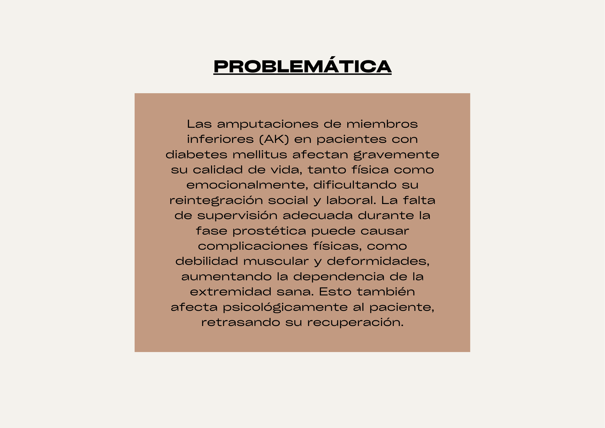

**Problemática:**
Las prótesis disponibles para personas mayores con amputación arriba de la rodilla (AK F2) no cubren adecuadamente sus necesidades específicas, como subir gradas o mantener el equilibrio en la ducha. La adaptación es más difícil debido a la edad, lo que afecta su movilidad, incrementa el riesgo de caídas y reduce su calidad de vida al aumentar la dependencia.

**Estado de Arte **

**Contexto Comercial**

Equipos

<table>
  <tr>
    <td>Nombre del producto</td>
    <td>Imagen Referencial</td>
    <td>Características</td>
  </tr>
  <tr>
    <td>Rodilla 3R80 Otto Bock

</td>
    <td></td>
    <td>Resistente al agua
"Sistema hidráulico de rotación"
Grado de movilidad 3 y 4 (puede aguantar niveles o actividades que requieren gran energía)
Peso de usuario <150 kg
Costo aproximado: 8500 dólares
Peso de la prótesis: 1,2 kg aprox.</td>
  </tr>
  <tr>
    <td>C-Leg 4 by Ottobock</td>
    <td></td>
    <td>Grado de movilidad: 2, 3, 4
Peso máximo: 136 kg.
Prótesis controlada por un microprocesador
Ajuste en tiempo real según la manera de caminar.
No es completamente resistente al agua, sin embargo resiste climas de lluvia.
Cuenta con modo ahorro de batería y cargador tipo USB
Conexión vía app con teléfono del usuario
Costo aproximado: 40-50 k dólares</td>
  </tr>
  <tr>
    <td>Plié 3</td>
    <td></td>
    <td>Peso máximo: 125 kg.
Peso de la prótesis: 1.235 kg.
Prótesis controlada por microprocesador 
Resistente al agua
Responde con una rapidez considerablemente mayor a la de otro tipo de prótesis de este tipo.</td>
  </tr>
</table>



Patentes

**Patente 1: **
US020180008421A120180111
Anatomical motion hinged prosthesis

United States  

Enero 11 , 2018  
La patente propone una prótesis de rodilla con una mecánica mejorada para lograr un movimiento más natural y reducir el desgaste, utilizando una combinación de superficies de curvatura excéntrica y mecanismos de guía para lograr una rotación y traslación cinemáticamente correctas.

### **Funcionamiento**

1. **Componentes Principales**:

    * **Componente Tibial**: Se fija en la tibia y tiene una superficie de apoyo.

    * **Componente Femoral**: Se conecta al componente tibial mediante una bisagra y tiene dos cóndilos (medial y lateral).

2. **Superficies de Curvatura**:

    * **Cóndilos Medial y Lateral**: Estos tienen superficies de curvatura sagital excéntrica. Estas superficies están diseñadas para inducir la rotación axial del componente femoral sobre el componente tibial.

    * **Superficies de Contacto**: Las superficies de curvatura excéntrica permiten una rotación controlada y una traslación A/P (anterior/posterior) durante el movimiento de flexión de la rodilla.

3. **Mecanismo de Rotación y Traslación**:

    * **Rotación Axial**: El diseño permite que el componente femoral gire sobre el componente tibial durante la flexión de la rodilla, imitando la rotación natural de la rodilla humana.

    * **Traslación A/P**: A medida que la rodilla se flexiona, la interacción entre los cóndilos y la superficie tibial permite que el componente femoral se desplace en la dirección anterior/posterior, lo que ayuda a reproducir el movimiento natural de la rodilla.

4. **Eje y Poste**:

    * **Perno de Bisagra**: Un perno de bisagra ubicado transversalmente entre los cóndilos medial y lateral ayuda a controlar el movimiento rotacional del componente femoral.

    * **Poste**: Se extiende desde el componente tibial al componente femoral y se conecta al perno de bisagra. Este poste puede tener un diseño de manga para permitir la rotación axial relativa entre el poste y el componente tibial.

### **Características Resaltantes**

1. **Curvaturas Excéntricas**:

    * Las superficies de curvatura excéntrica en los cóndilos medial y lateral permiten un movimiento de rotación más natural y controlado, adaptándose mejor a la anatomía de la rodilla.

2. **Guía de Movimiento**:

    * La superficie de apoyo del componente tibial tiene áreas específicas diseñadas para guiar los cóndilos femorales durante la flexión, lo que facilita tanto la rotación como la traslación A/P.

3. **Reducción del Desgaste**:

    * Al distribuir las fuerzas y el contacto de manera más uniforme y permitir un movimiento más natural, el diseño reduce el desgaste en el implante y minimiza el daño a los tejidos blandos circundantes.

4. **Alineación de Centros de Rotación**:

    * La patente describe que los centros de rotación de las superficies de curvatura pueden no estar alineados entre los cóndilos medial y lateral, lo que permite un ajuste más preciso del movimiento.

5. **Método de Flexión**:

    * Se incluye un método para inducir la rotación axial y la traslación A/P a través del rango de flexión de la rodilla, mejorando la funcionalidad y el ajuste del implante durante el movimiento.

6. **Diseño de Manga para el Poste**:

    * El diseño del poste con una manga permite la rotación axial relativa entre el poste y el componente tibial, facilitando el movimiento natural y evitando restricciones en el rango de flexión.

**Patente 2:**

## WO2018085329A1

## Biomimetic transfemoral knee with gear mesh locking mechanism 

Mayo 11, 2018

## Una rodilla protésica que tiene un mecanismo de bloqueo pasivo de rodilla que utiliza el mismo mecanismo de cuatro barras que se encuentra en una rodilla natural. El mecanismo flexible de cuatro barras guía el movimiento de la rodilla, ayuda al retorno de la rodilla desde la flexión completa a la extensión, y conecta un engranaje femoral a un engranaje tibial. Al despegar el pie, no se aplica peso sobre la rodilla protésica, permitiendo que la rodilla se flexione. Los enlaces flexibles se estiran, aumentando así la rigidez de los resortes, y en la fase final del balanceo, momentos antes del golpe de talón, los enlaces flexibles del mecanismo de cuatro barras vuelven a la posición extendida/bloqueada y se bloquean una vez que el usuario aplica su peso sobre la rodilla.

**Características Resaltantes**

1. **Tibia rotativa**:

Tibia prostética rotativa en relación con el fémur prostético.

2. **Engranajes femorales y tibiales**:

Los lados curvados de los engranajes femorales y tibiales se reflejan entre sí a través de un plano horizontal entre ellos, de modo que los engranajes giran hacia atrás en relación con el otro a lo largo de sus lados curvados, con sus dientes engranados mientras los engranajes giran en relación con el otro.

3. **Enlaces ligamentosos**:

Los enlaces ligamentosos tienen un extremo asegurado al engranaje femoral y el extremo opuesto asegurado al engranaje tibial. Los enlaces también tienen una fuerza sesgada que facilita la rotación de posterior a anterior de los engranajes en relación con el otro.

4. **Similitud con los LCA y LCP**:

En formas adicionales, los enlaces ligamentosos pueden operar como un mecanismo de resorte de cuatro barras cruzadas que imitan un LCA y un LCP de una rodilla sana. Más específicamente, los enlaces ligamentosos incluyen dos enlaces LCA y dos enlaces LCP.

"[https://patents.google.com/patent/US20180008421A1/en?q=(prostetic+knee)&oq=prostetic+knee+](https://patents.google.com/patent/US20180008421A1/en?q=(prostetic+knee)&oq=prostetic+knee+)" 

**Patente 3:**

ES2823168T3

Sistema ortopédico

España

18.07.2017

La propuesta es un sistema ortopédico que integra electrodos de estimulación para activar músculos específicos, junto con un dispositivo ortopédico o protésico que permite el movimiento articulado. Este sistema busca mejorar el patrón de marcha y movimiento de pacientes con deficiencias en la activación muscular, ajustando la resistencia y controlando el movimiento a través de sensores y un dispositivo de control.

Funcionamiento: 

1. Electrodos de estimulación:

- Dispositivos que generan impulsos eléctricos para activar músculos o nervios, como electrodos de superficie, implantados, de manguito o híbridos, según su proximidad al nervio o músculo. Facilitan la contracción muscular, mejorando el movimiento en dispositivos ortopédicos o protésicos.

2. Sensores:

- Registran y miden variables como fuerzas, posiciones, aceleraciones y momentos en sistemas ortopédicos. Incluyen sensores de posición, fuerza o presión, y pueden ser incrementales o absolutos. Su información es clave para ajustar la resistencia y la estimulación muscular del dispositivo.

3. Dispositivo de control:

- Es un componente central que procesa los datos de los sensores y coordina la activación de los electrodos. Ajusta la resistencia del dispositivo ortopédico o protésico y controla los impulsos eléctricos enviados a los músculos. También permite la conexión inalámbrica para ajustes y lectura de datos externos.

**Características Resaltantes**

1. Resistencia ajustable:

- Permite modificar la resistencia al movimiento entre los componentes proximal y distal, adaptándose a las necesidades del paciente.

2. Mecanismo de accionamiento: 

- Es un sistema motorizado que facilita el movimiento en dispositivos ortopédicos o protésicos, transformando la energía en flexión, extensión o pivotamiento. Su funcionamiento se coordina con el control y los sensores para optimizar el rendimiento según las necesidades del usuario.

3. Acumulador de energía:

- Puede ser un acumulador de resorte, presión o energía eléctrica, que almacena energía para su uso durante el funcionamiento.

4. Configuración para extremidades inferiores: 

- El dispositivo puede ser diseñado específicamente como órtesis o prótesis para las extremidades inferiores, mejorando la movilidad y el patrón de marcha del paciente.



Lista de Requerimientos:

<table>
  <tr>
    <td>Requerimientos Funcionales</td>
    <td>Requerimientos No Funcionales</td>
  </tr>
  <tr>
    <td>Reducir el esfuerzo físico del paciente</td>
    <td>Cómodo</td>
  </tr>
  <tr>
    <td>Facilitar su movimiento</td>
    <td>Fácil de transportar</td>
  </tr>
  <tr>
    <td>Permitir que el paciente realice actividades cotidianas de manera normal</td>
    <td>Económicamente accesible</td>
  </tr>
  <tr>
    <td>Respuesta rápida a los movimientos del paciente</td>
    <td>Visualmente agradable</td>
  </tr>
</table>



Propuesta de solución:

-Creación de una prótesis que facilite los movimientos que demandan un tiempo prolongado de rehabilitación, así como esfuerzo físico y equilibrio, para adultos mayores.

