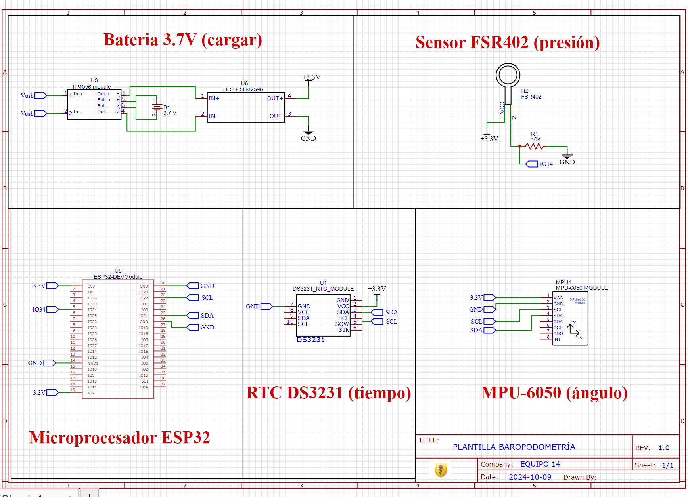
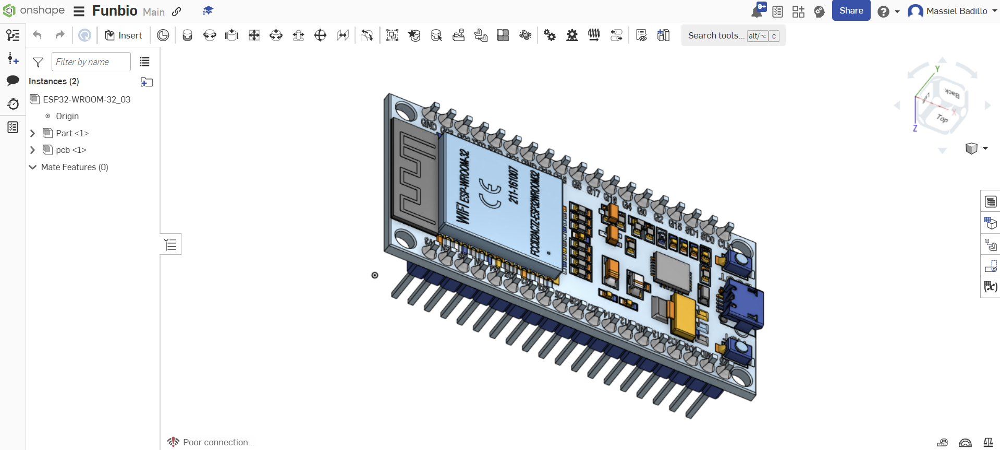
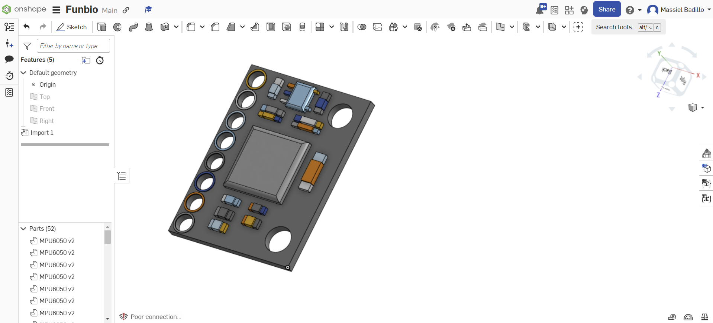
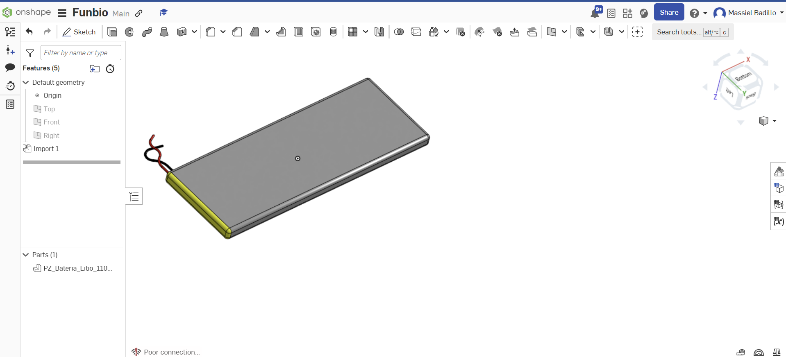
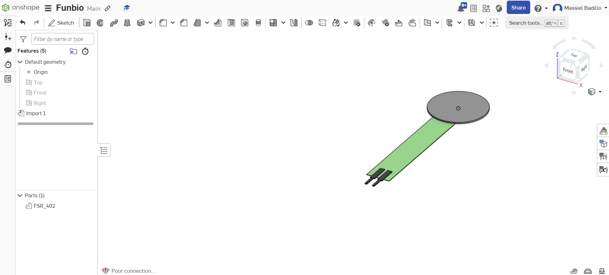
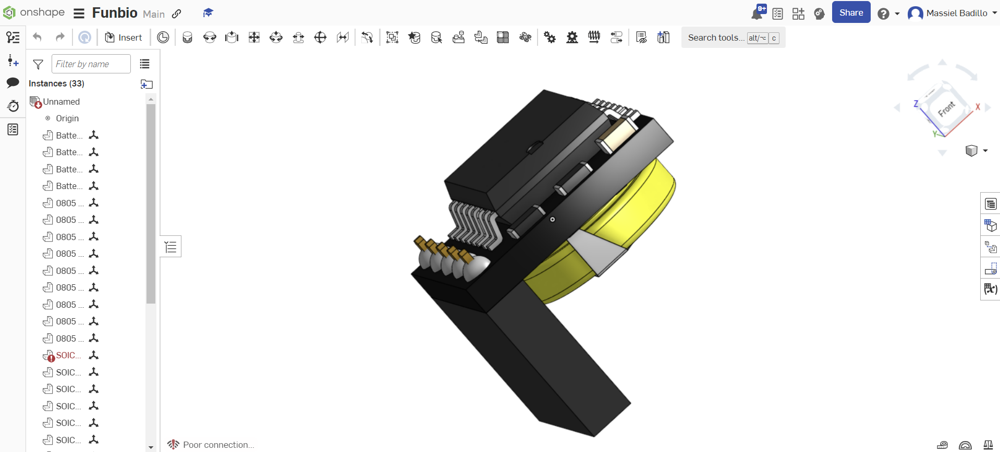

Diagrama o esquema electrónico el concepto de solución:

Modelado 3D de los componentes por separado

Modelo ESP32 importado en onshape:

Importado en sketch: https://skfb.ly/prHzC

Modelo sensor MPU6050 importado en onshape:

Importado en sketch: https://skfb.ly/prHzE

Modelo Batería de Litio importado en onshape:

Importado en sketch: https://skfb.ly/prHzJ

Modelo sensor FSR402 importado en onshape:

Importado en sketch: https://skfb.ly/prHzL

Modelo sensor RTC DS3231 importado en onshape:

Importado en sketch: https://skfb.ly/prHzO

