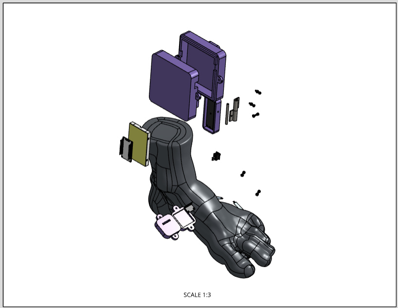
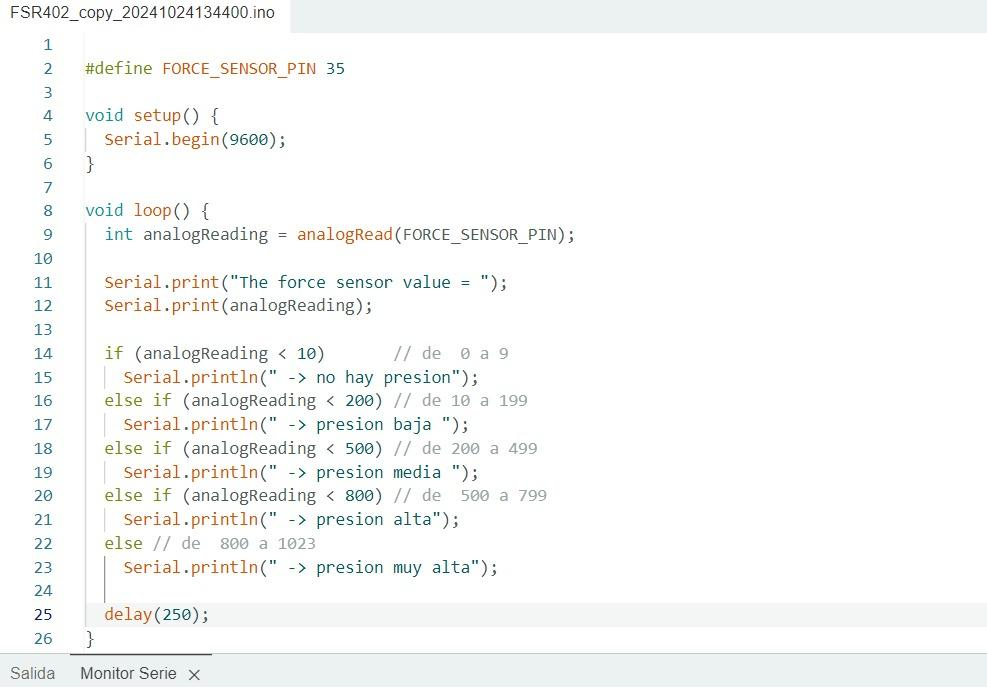

Modelado 3D  

Diseño en onshape ensamblado: 

[https://cad.onshape.com/documents/b59706230b3147a766a9d8ca/w/d9faae820f9fd83e4ae611a1/e/01ad5f6915a1a5d2a1a74f02?renderMode=0&uiState=6723c22bf9372f17bf1ea62b](https://cad.onshape.com/documents/b59706230b3147a766a9d8ca/w/d9faae820f9fd83e4ae611a1/e/01ad5f6915a1a5d2a1a74f02?renderMode=0&uiState=6723c22bf9372f17bf1ea62b)

Diseño en sketchfab: 

[https://skfb.ly/p8uXs](https://skfb.ly/p8uXs)

Plano de materiales y electronicos a usar: 

[https://cad.onshape.com/documents/b59706230b3147a766a9d8ca/w/d9faae820f9fd83e4ae611a1/e/3d03eb26edddc29ad61f9a50](https://cad.onshape.com/documents/b59706230b3147a766a9d8ca/w/d9faae820f9fd83e4ae611a1/e/3d03eb26edddc29ad61f9a50)

Vista explosionada: 

[https://cad.onshape.com/documents/b59706230b3147a766a9d8ca/w/d9faae820f9fd83e4ae611a1/e/c8d9c10dc0672cda1a7d5a13](https://cad.onshape.com/documents/b59706230b3147a766a9d8ca/w/d9faae820f9fd83e4ae611a1/e/c8d9c10dc0672cda1a7d5a13)

Plano 1: 

[https://cad.onshape.com/documents/b59706230b3147a766a9d8ca/w/d9faae820f9fd83e4ae611a1/e/08a3d7ae921a38b4f6f29460](https://cad.onshape.com/documents/b59706230b3147a766a9d8ca/w/d9faae820f9fd83e4ae611a1/e/08a3d7ae921a38b4f6f29460)

Plano 2:

[https://cad.onshape.com/documents/b59706230b3147a766a9d8ca/w/d9faae820f9fd83e4ae611a1/e/36dad9e3779bb2fee486169c](https://cad.onshape.com/documents/b59706230b3147a766a9d8ca/w/d9faae820f9fd83e4ae611a1/e/36dad9e3779bb2fee486169c)

Plano 3: 

[https://cad.onshape.com/documents/b59706230b3147a766a9d8ca/w/d9faae820f9fd83e4ae611a1/e/b961a66d338589d1d2fa348e](https://cad.onshape.com/documents/b59706230b3147a766a9d8ca/w/d9faae820f9fd83e4ae611a1/e/b961a66d338589d1d2fa348e)

Plano 4:

[https://cad.onshape.com/documents/b59706230b3147a766a9d8ca/w/d9faae820f9fd83e4ae611a1/e/c9a6fd440dc8c1fb4327c2c3](https://cad.onshape.com/documents/b59706230b3147a766a9d8ca/w/d9faae820f9fd83e4ae611a1/e/c9a6fd440dc8c1fb4327c2c3)

Plano 5:

[https://cad.onshape.com/documents/b59706230b3147a766a9d8ca/w/d9faae820f9fd83e4ae611a1/e/6f08b86290c640afea8cab9f](https://cad.onshape.com/documents/b59706230b3147a766a9d8ca/w/d9faae820f9fd83e4ae611a1/e/6f08b86290c640afea8cab9f)

Esquemático electrónico:

Electrónica

 

Programación: 

Monitor serie del código: 

Gráfica de los valores obtenido en t:

