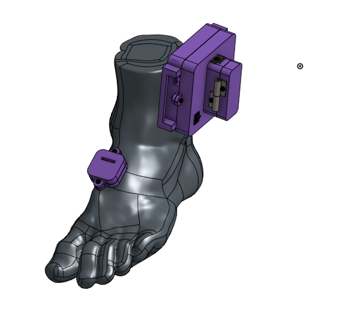
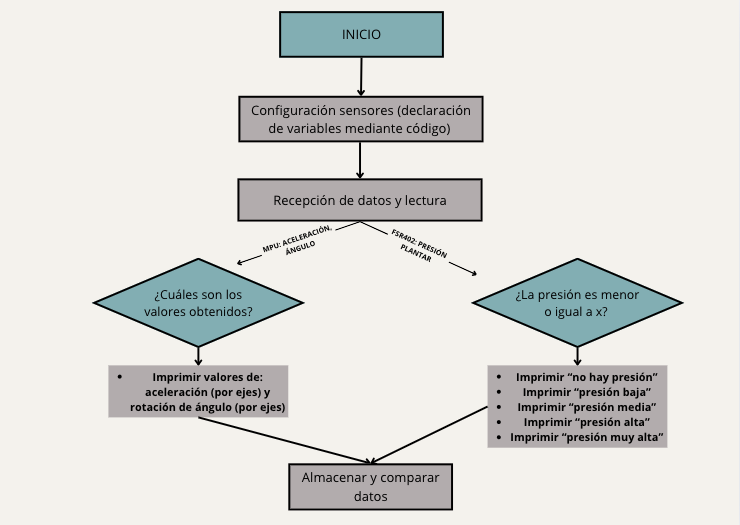
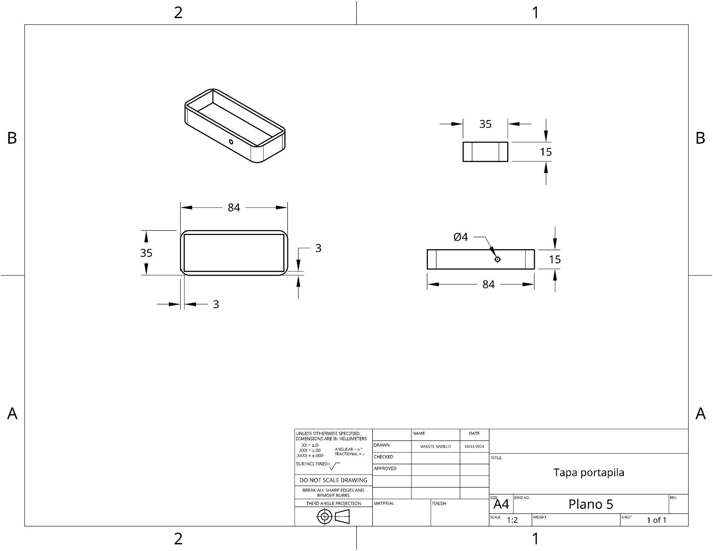
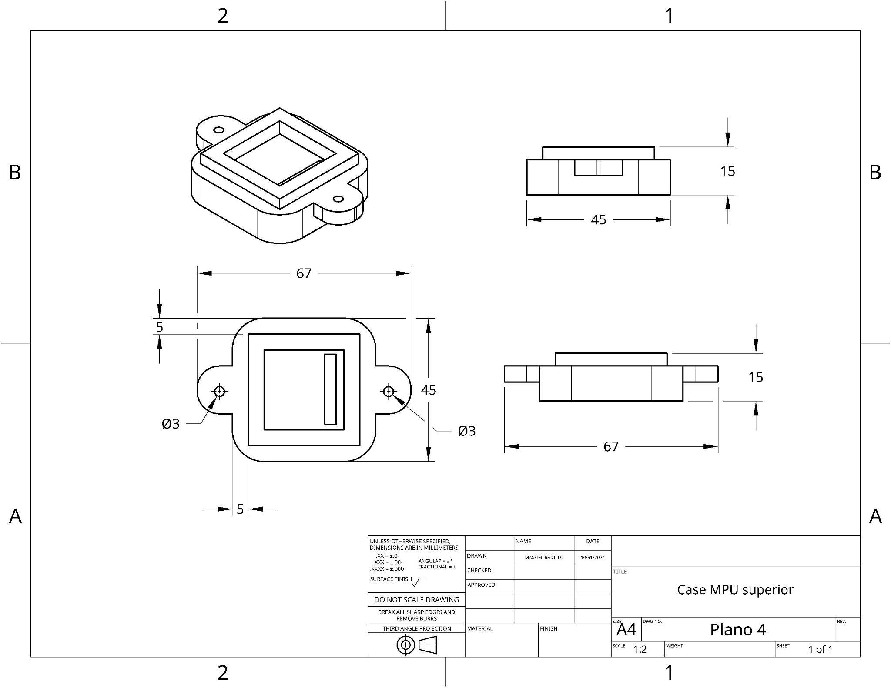
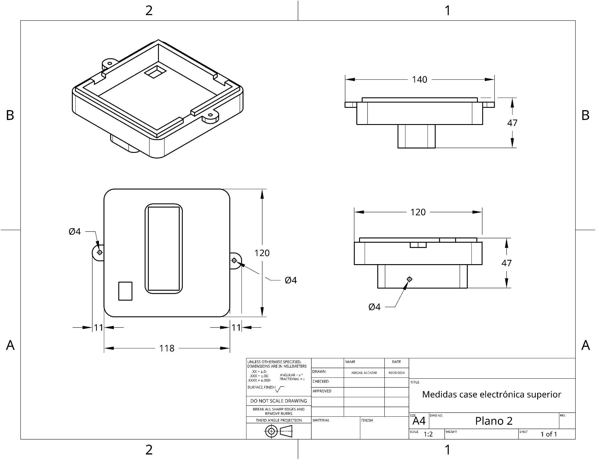
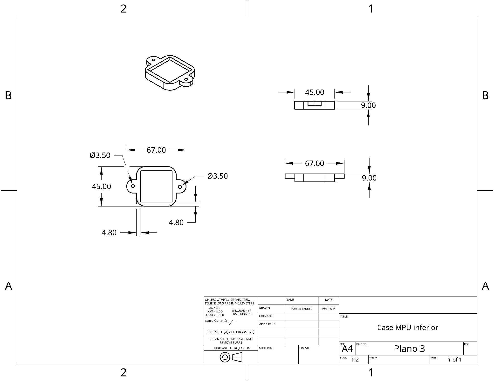
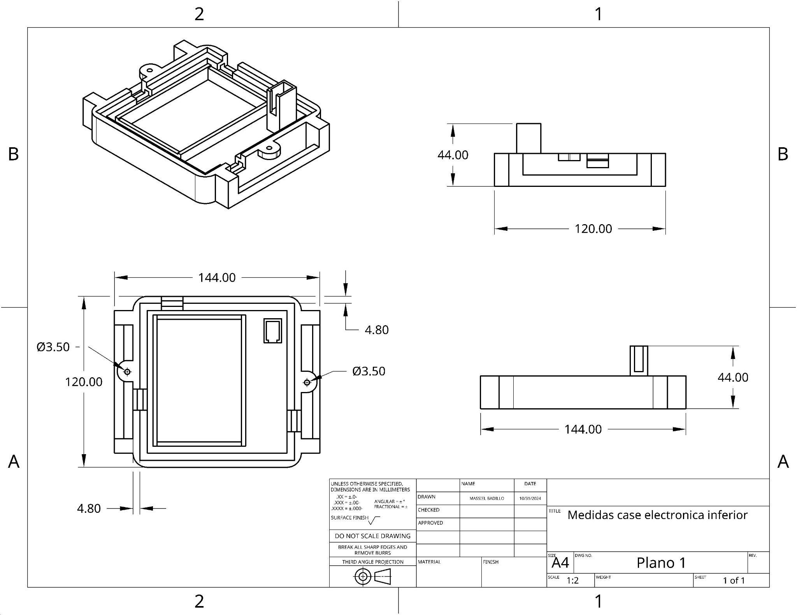
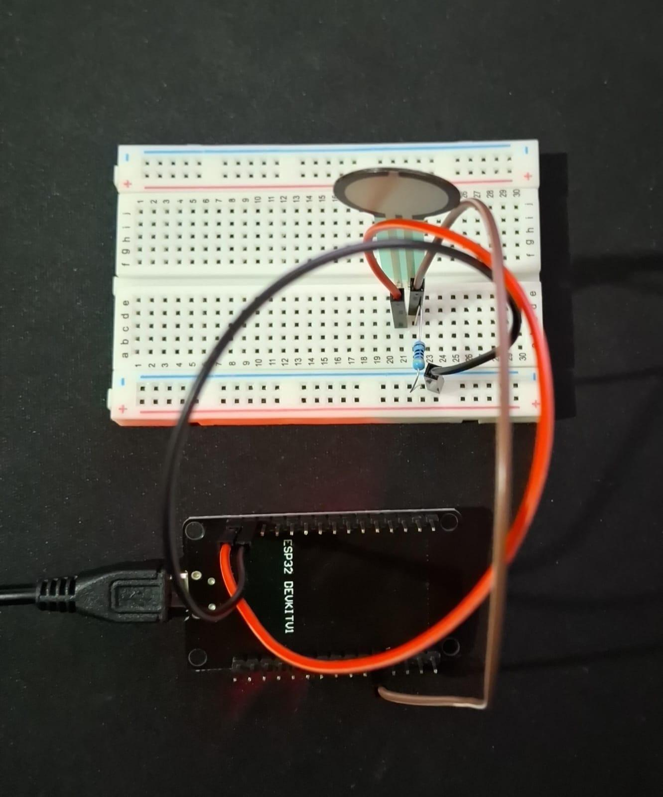
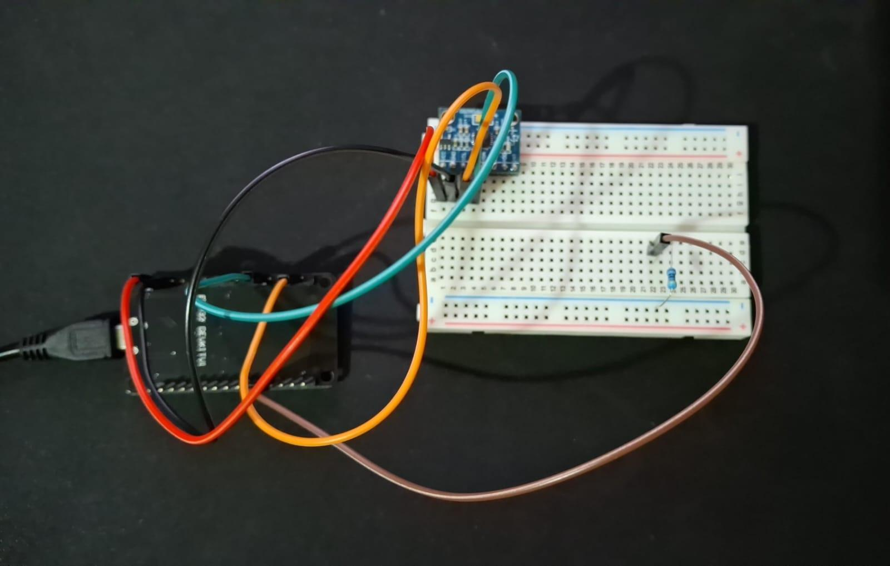

**Vista del ensamble 3D:**

**Diagrama de Flujo de Datos:**

Este esquema realiza una representación de los pasos que serán ejecutados por los componentes electrónicos, así como los datos que serán obtenidos a través de ellos.

º

Planos:

Electrónica:


FSR402


Codigo:
[https://github.com/lucasdmr24/Funbio-Proyecto/blob/main/Documentacion/Entregables/Entregable%207/FSR402.md](https://github.com/lucasdmr24/Funbio-Proyecto/blob/main/Documentacion/Entregables/Entregable%207/FSR402.md)


MPU6050

Código:
[https://github.com/lucasdmr24/Funbio-Proyecto/blob/main/Documentacion/Entregables/Entregable%207/MPU4050.md](https://github.com/lucasdmr24/Funbio-Proyecto/blob/main/Documentacion/Entregables/Entregable%207/MPU4050.md)

