**​​1. Introducción y Contextualización del Prototipo**

**Descripción del proyecto:**

El producto se basa en un sistema de sensores tanto de presión como de ángulo con el fin de llevar a cabo un monitoreo respecto a esos parámetros de la pisada de un paciente con amputación, puesto que estos valores se ven afectados tras este tipo de casos; ya sea aumentando el desequilibrio o reduciendo la movilidad de ángulo de la extremidad sana. Es decir, el proyecto está enfocado en la parte posterior a la entrega de la prótesis del paciente (seguimiento).

**Problemática abordada:**

Las amputaciones son más frecuentes en adultos mayores, los cuales representan alrededor del 45% de la población con pérdida de extremidades. Como consecuencia de una amputación, el centro de masa se ve afectado y altera significativamente el equilibrio al caminar. Las amputaciones de miembros inferiores (AK) en pacientes con diabetes mellitus afectan gravemente su calidad de vida, tanto física como emocionalmente, dificultando su reintegración social y laboral. La supervisión inadecuada durante la fase prostética puede causar complicaciones físicas, como debilidad muscular y deformidades, aumentando la dependencia de la extremidad sana. Esto también afecta psicológicamente al paciente, retrasando su recuperación. 

**Objetivos de la fase de integración:**

Se espera que a través de este proyecto los parámetros de presión plantar y ángulo de progresión de marcha logren ser medidos simultáneamente y desde un lugar que no sea necesariamente un establecimiento de salud, sino que pueda ser usado por el paciente independientemente.

**2. Componentes del prototipo**

Para comprender la función de cada componente, primero se elaboró un esquema de funciones donde se describen las funciones principales que busca el proyecto.

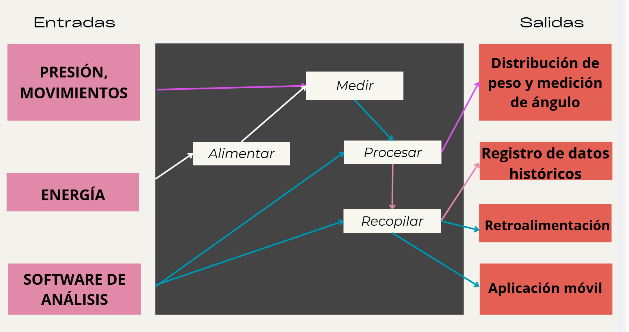

Con este esquema, se lograron identificar los componentes principales para llevar a cabo los requerimientos funcionales y no funcionales:

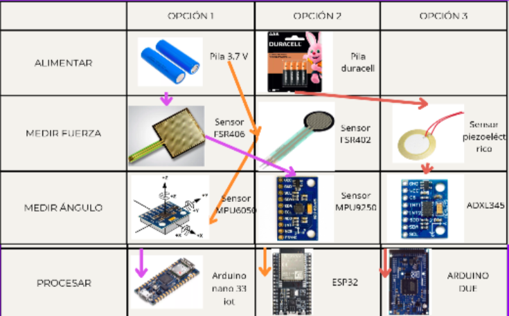

(Tras una evaluación en base a criterios de funcionalidad se escogió la opción 1)

Para poder describir la interacción entre los componentes, se procedió a realizar un esquemático electrónico: 

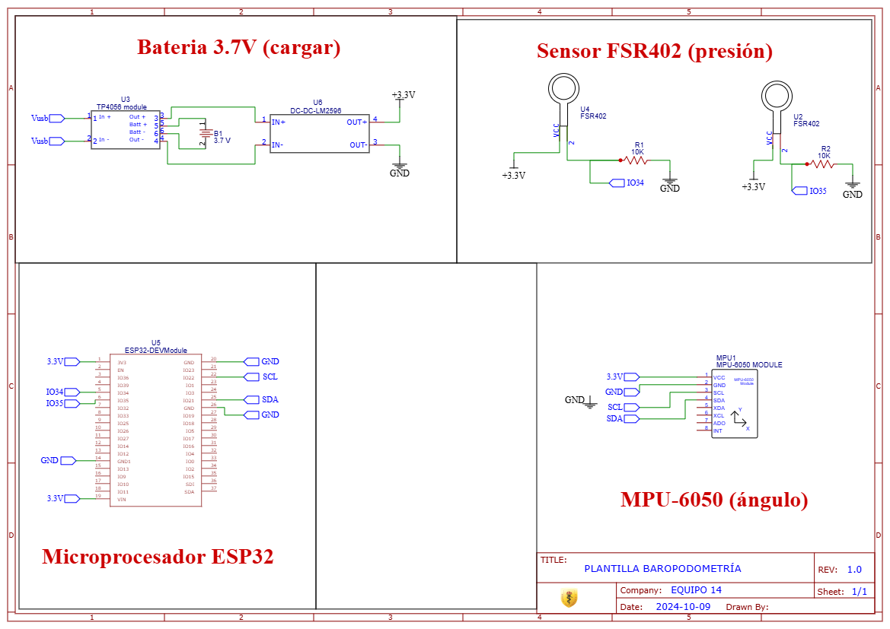

**3, ****Proceso de Integración**

**Plan de integración:**

Tras tener las funciones establecidas, se procedió a identificar cómo irían conectados los componentes necesarios y cómo se deben distribuir para cumplir su función. Tomando en cuenta esto, se procedió a identificar 3 modelos importantes en el 3D para nuestro proyecto: un case para el MPU, uno para el resto de componentes electrónicos y una tapa para el portapila. A continuación, se muestran los planos, el ensamble y el link del onshape: [https://cad.onshape.com/documents/b59706230b3147a766a9d8ca/w/d9faae820f9fd83e4ae611a1/e/5ab465d6ad715a8f3c73b799](https://cad.onshape.com/documents/b59706230b3147a766a9d8ca/w/d9faae820f9fd83e4ae611a1/e/5ab465d6ad715a8f3c73b799)

*Planos case MPU superior e inferior:*

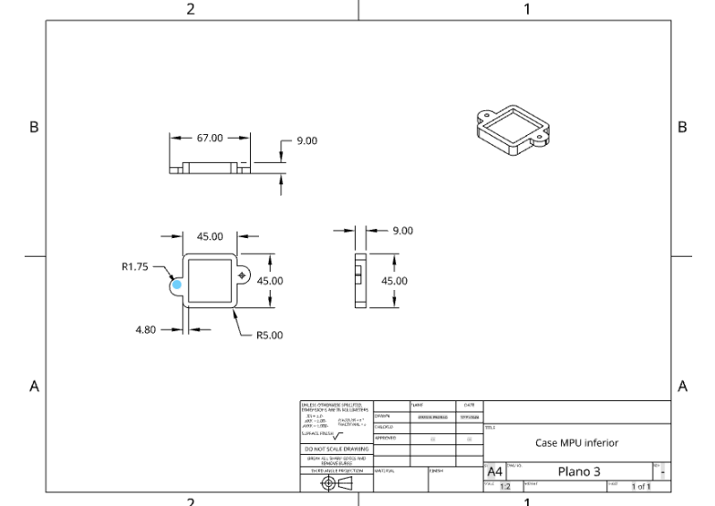

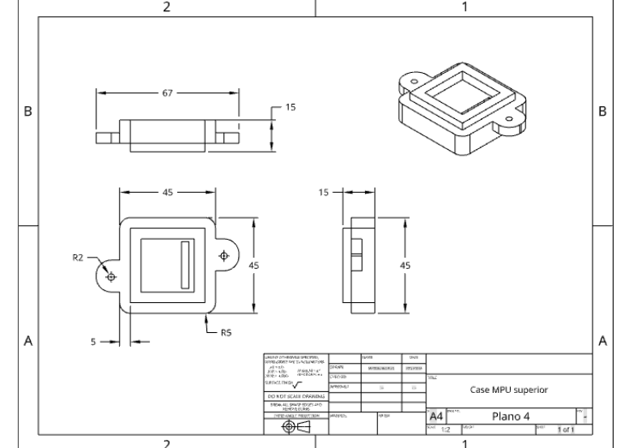

*Planos para el case de los demás componentes electrónicos:*

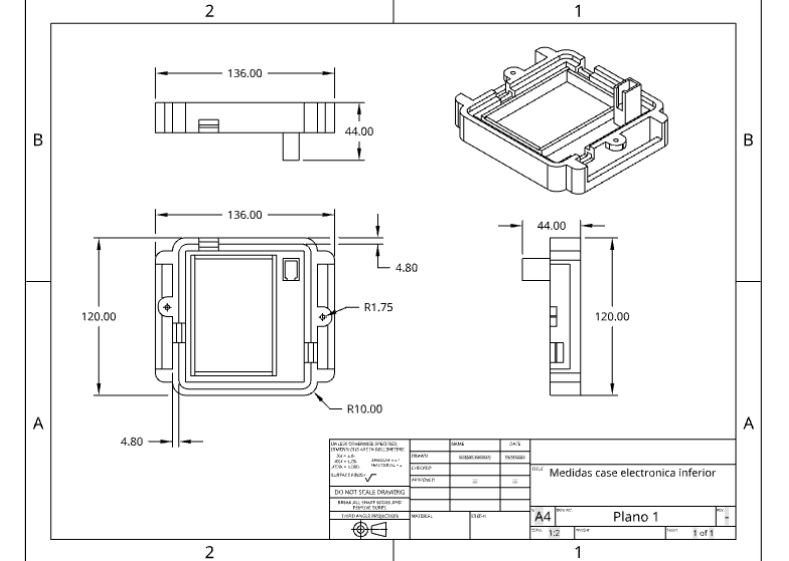

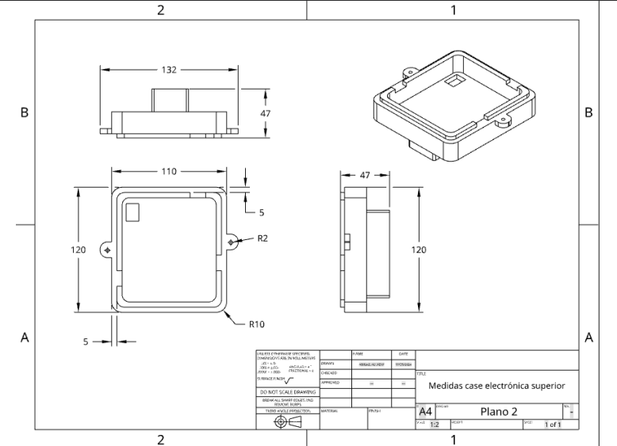

*Plano para case del portapila:*

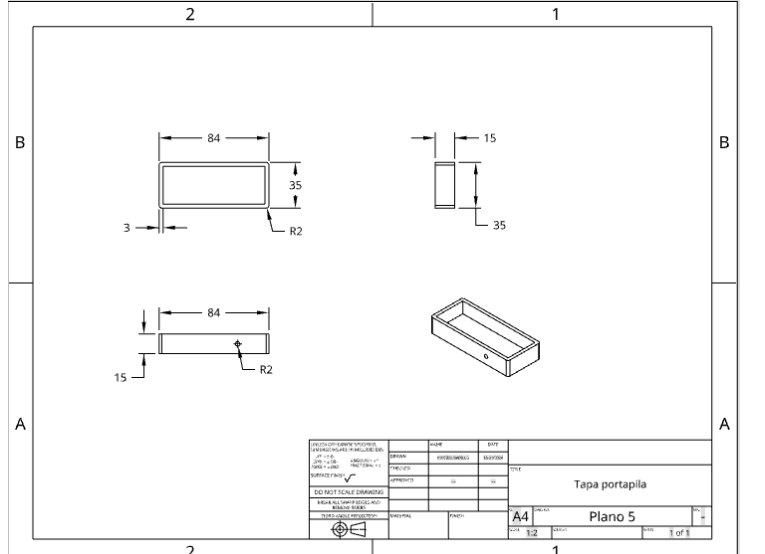

*Ensamble:*

**_Observaciones (Desafíos y ajustes realizados):_**

* Las piezas se encuentran en cola para imprimir, los planos han sido aprobados.

* La corrección de los planos respecto al anterior entregable se basa principalmente en los bordes de las piezas, de manera que se añadieron fillets.

* El objetivo principal de este diseño es la portabilidad y la comodidad del usuario al usar el dispositivo (por lo que no se usan demasiadas piezas) con el fin que sea fácil de poner y sacar.

* La unión está planeada con un velcro, de manera que simule una tobillera.

**_Revisión de compatibilidad y sincronización:_**

**Aún no realizó la prueba de compatibilidad por el cierre de la universidad por esta semana ****_
_**

**4. Pruebas y Verificación:**

**Descripción de pruebas funcionales:**

Primero se armó el circuito de cada sensor por separado comenzando con el acelerómetro.

MPU6050

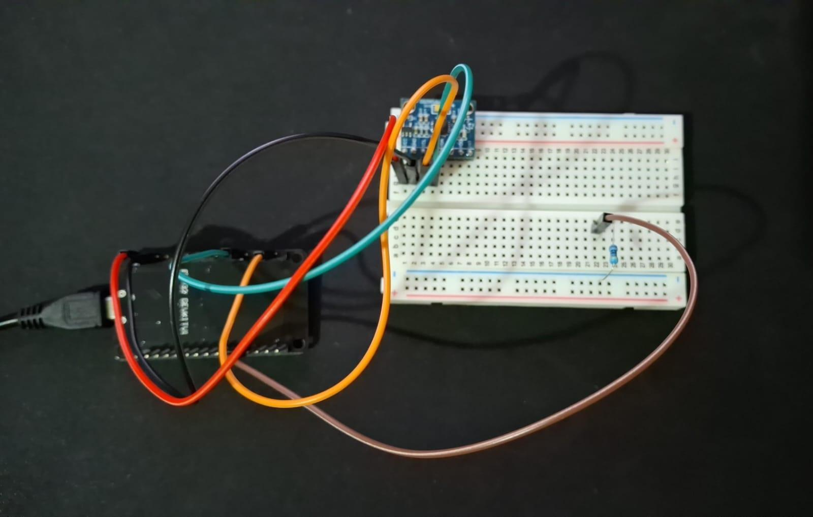

**
**

Al principio se quería medir el cambio de ángulo de inclinación respecto a un punto inicial guardado pero esto no era posible, así que optamos por cambiar eso y medir el cambio de posición respecto a un punto guardado así obtendremos que tan preciso es el recorrido de las pisadas, también añadimos un giroscopio que medirá el cambio constante del ángulo que en teoría debería ser de baja variación (se harán las pruebas respectivas después para tener con qué datos comparar). 

Después teníamos que  calibrar el MPU6050 y cambiar parámetros como el "delay" a “millis” para tener un monitoreo más continuo y sin cortes 

Después armamos el circuito del FSR402

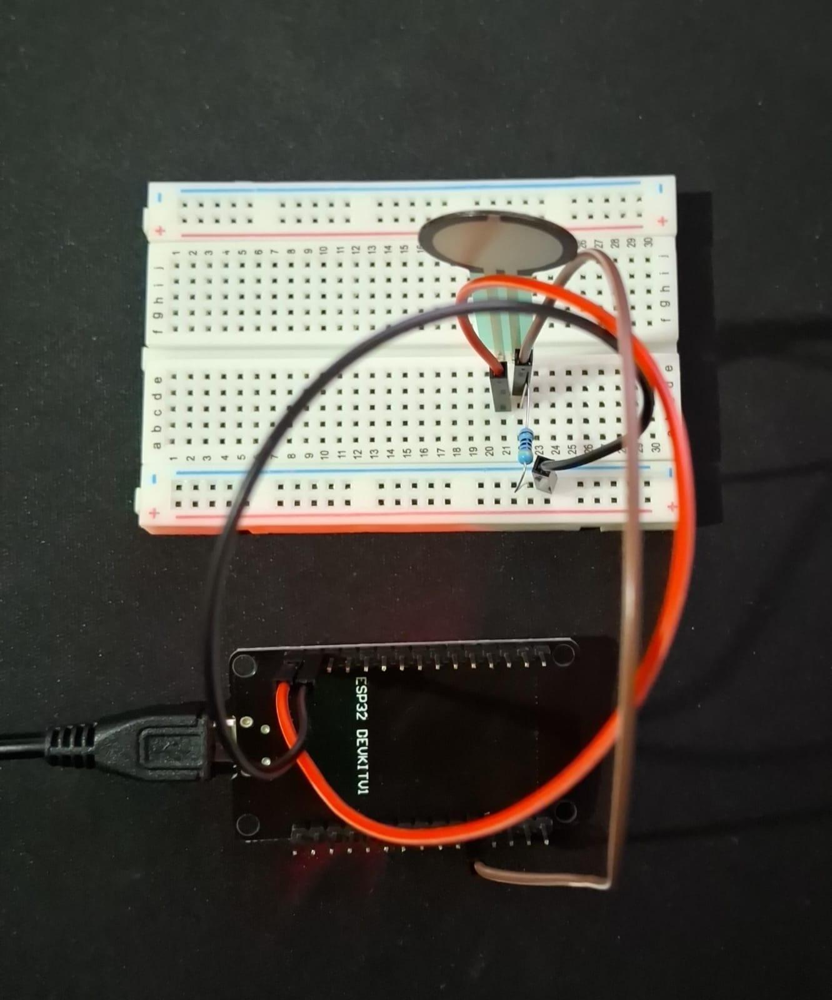

Después añadimos un segundo FSR402 (ambos FSR402 están conectados a entradas ADC en este paso D34 y D35) y duplicamos el código modificando las definiciones del sensor como "FSR402_1" y segundo el añadido como “FSR402_2”.

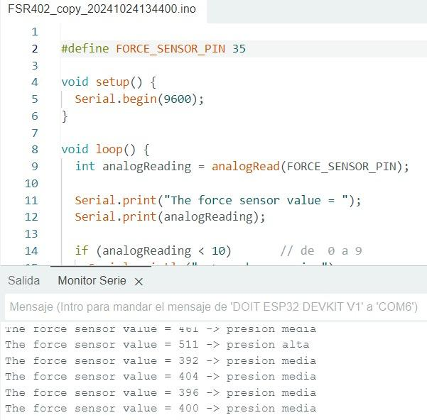

Prueba de 1 FSR402


Al final juntamos todo el circuito cambiando el código de delay a millis y ajustando los printf

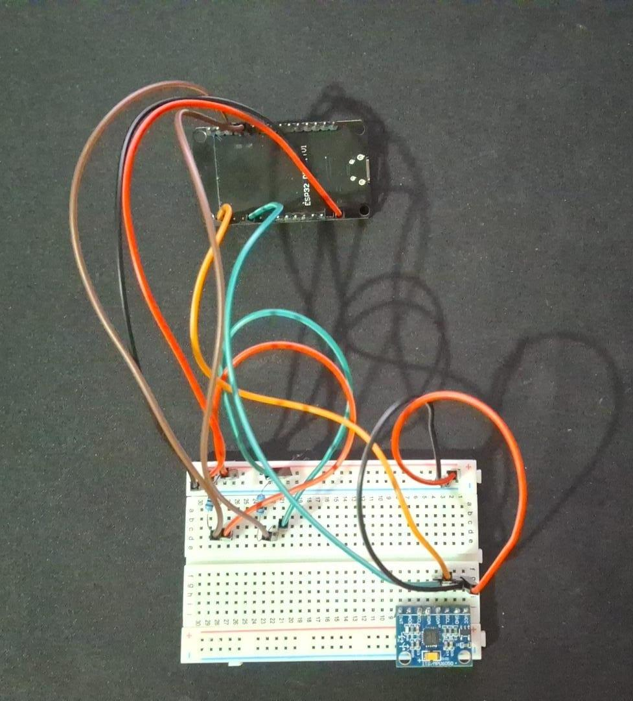

Código Final:

[https://github.com/lucasdmr24/Funbio-Proyecto/blob/main/Documentacion/Software/codigo%20final.md](https://github.com/lucasdmr24/Funbio-Proyecto/blob/main/Documentacion/Software/codigo%20final.md)

**5. Conclusiones y Próximos Pasos **

**Resumen de Logros**

* Aprobación de los modelados 3D de las piezas a imprimir.

* Los componentes electrónicos se han unido en simultáneo y funcionan adecuadamente.

* El código está completado y los datos se pueden medir en tiempo real.

* Se puede visualizar la fluctuación de los datos en una gráfica que varía en tiempo real de acuerdo al cambio de los datos.

**Aspectos a Mejorar**

* Aún requerimos de las partes 3d en físico para hacer pruebas finales además de buscar una tobillera que cumple los requisitos de nuestro sistema.

* También falta añadir el TP4056 que adquirimos hace poco y un botón switch. Luego cambiar el circuito de prototipo a uno final cambiando los jumpers con cables de calibre 24 

**Siguientes fases del desarrollo **

* Imprimir los componentes 3D y verificar que estos se hayan impreso de manera correcta.

* Realizar el circuito final junto con los cambios en los componentes que sean necesarios.

* Acoplar el circuito final junto con los componentes 3D para realizar pruebas con el prototipo ya completamente ensamblado.

