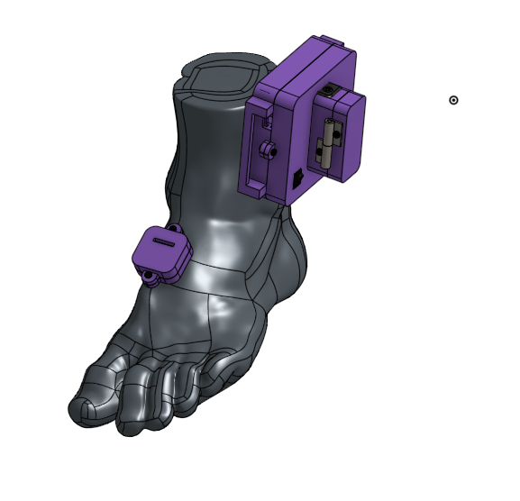

**Ficha de detalles de la invención**

<table>
  <tr>
    <td>Título de la invención:</td>
    <td>PreasurePro</td>
  </tr>
</table>

1. **DESCRIPCIÓN DEL PROBLEMA TÉCNICO**

Indique y describa cuál es el problema técnico (o los problemas técnicos) que busca resolver la invención. 

*Se considera problema técnico aquel aspecto técnico (estructura, configuración, entre otros), que antes de la invención no tenía solución o tenía soluciones distintas a la provista por la invención.*

*En caso de Diseño Industrial, omitir esta parte.*

El problema que se busca resolver específicamente es la comparación de datos de 2 extremidades en tiempo real. Cuando una persona sufre una amputación, el centro de masa tiende a desplazarse y a perjudicar la extremidad sana. Es por ello que es imprescindible contar con un dispositivo que permita la comparación entre ambos miembros y, poder finalmente ver que ambos valores de presiones o fuerzas ejercidas sean similares; de lo contrario, el paciente podría estar sujeto a otras complicaciones médicas. De esta misma manera, se busca obtener datos como la medición de ángulo, puesto que cuando a una persona se le brinda una prótesis y durante ese proceso no se logra adaptar adecuadamente, su libertad de movimiento puede verse afectada. El ángulo de progresión de marcha es una medida que nos permite cuantificar la libertad con la que una extremidad se mueve, 

En pocas palabras, el producto busca brindar datos con el fin de acompañar al paciente amputado en el periodo prostético. Uno de los objetivos principales es poder aplicarlo al rubro de la telemedicina y que este sirva como un canal de comunicación/información entre el personal de salud y el paciente. De manera que mediante el almacenamiento y procesamiento de datos, se logre supervisar parámetros que afecten el día a día del paciente y con el fin principal de evitar la aparición de malestares sujetos al uso de la prótesis.

2. **DESCRIPCIÓN DETALLADA DEL INVENTO:**

Describa la invención de forma clara enfatizando en qué consiste el concepto inventivo central.

Si la invención es un producto, máquina, equipo y especifique sus partes y cómo se relacionan.

Si la invención es un procedimiento, especifique los pasos, parámetros de operación, insumos, o cualquier otra información relevante para alcanzar el efecto técnico. 

La invención puede tener el procedimiento y su producto novedosos por lo que puede detallar los dos. 

(Mínimo 250 palabras). *Incluya figuras, fotografías o diagramas.* *Adjunte a esta ficha todos las publicaciones u otros documentos asociados que posea al respecto*

En caso de Diseño Industrial, adjuntar imágenes o fotos del producto

El producto es un acoplamiento de ciertas piezas en uno solo. Consta de 2 cajas de soporte unidas a una tobillera; así como una caja de portapila. Dentro de estas cajas, se pueden encontrar los componentes electrónicos que permiten el funcionamiento del dispositivo.

En primer lugar, el dispositivo es alimentado por un voltaje que proviene de la batería (3.7 V), la cual está vinculada con un módulo de carga con el fin de ser recargable y evitar que el usuario esté cambiando constantemente de baterías. El dispositivo se prende a través de un botón switch que activa el sistema electrónico (protoboard,esp32,resistencias,sensores,etc). Asimismo, a través de bluetooth, se logra obtener las mediciones de los sensores en un dispositivo móvil.

En la imagen se puede observar las 3 cajas mencionadas anteriormente y cómo estarían distribuidas en una extremidad sana. 

Los sensores que se han usado para la obtención de datos son 2 FSR402 (ubicados en la parte inferior de la planta del pie y los que miden presión plantar) y un MPU (medición de ángulo). Se integran los 3 sensores que se usan por extremidad son configurados para obtener los parámetros en tiempo real.

En esta imagen se logra observar el prototipo una vez que los componentes han sido unificados y el circuito funciona correctamente, realizando y entregando los datos solicitados.

Como se observa en la imagen, los componentes, tanto los impresos 3D como los electrónicos han sido integrados finalmente en una tobillera. Esto se realizó con la finalidad de evitar el uso de muchas piezas por separado, lo cual puede inducir a una mayor confusión en el usuario o la tendencia a extraviar alguna pieza y afecte el funcionamiento del dispositivo.

3. **DESCRIPCIÓN DE LOS ANTECEDENTES**

Liste y describa los productos, procedimientos más parecidos a su proyecto y los principales antecedentes técnicos o bibliográficos que haya consultado. Explique cuáles fueron los principios técnicos en los que se inspiró para obtener la invención; o que usó y estudió durante el proceso de investigación que dio como origen al proyecto. Pueden ser papers, tesis, vídeos, documentos, libros, etc.

Para llegar a realizar este dispositivo, se tomó como referencia principal el estudio usado en la fisioterapia: baropodometría; la cual consiste principalmente en "el estudio biomecánico que mide las presiones plantares mientras el paciente camina o permanece de pie" Al cual se le añadió la medición de ángulo con el fin que el especialista pueda evaluar estos parámetros y compararlos. 

Se encontraron 2 principales productos que sirven como referencia para el desarrollo de este producto:

1. **Plataforma de presiones plantares: **

* Sistema de medición de presiones plantares que consta de una plataforma portátil.

* Ideal para identificar el tipo de pie según su apoyo.

* Muestra la distribución del peso del paciente en sus pies durante la marcha mientras incide en la plataforma o está en reposo.

* Peso: 4.5 kg

* Sensores Resistivos

2. **XSENSOR in-shoe pressure measurement system: **

* Recopilación de datos en tiempo real

* Sensor de mapeo de presión plantar

* Detección dinámica inteligente permite un rendimiento elevado

* No se dobla bajo presión.

* No disponible en Perú

Las características principales que encontramos en estos dispositivos radican principalmente en la medición de presiones plantares. Sin embargo, no se encontró un dispositivo que lo integre con la medición con sensor acelerómetro/giroscopio como el MPU y su respectiva integración por medio de un software a la telemedicina. La plataforma es usualmente puesta en uso para los exámenes de seguimiento al paciente de baropodometría.

.

    1. **¿Conoce algún trabajo o invento que se parece más a su invento? **Si la respuesta es afirmativa, enumerar, indicando el nombre de la publicación, la fuente y fecha de publicación y adjuntar un breve resumen de dicho antecedente.

Nombre de la publicación:  Analysis and detection system for abnormal pressure caused by diabetic sole lesion:

Fuente: 冯志宏. (2022). Analysis and detection system for abnormal pressure caused by diabetic sole lesion (Patent Núm. CN:114366079:A). En Patent (CN:114366079:A).

Fecha publicación:  2022-01-14

Se refiere a un sistema de análisis y detección de anomalías de presión causadas por lesiones de la planta diabética. Esta compensa los defectos de la placa plana de medición de fuerza y ​​la plataforma de medición de fuerza a través del sistema de prueba de calzado y plantilla, puesto que en este sistema, se logra integrar directamente los sensores en áreas de posición correspondientes del zapato y la plantilla, de forma que puede recopilar datos dinámicos de presión plantar en el zapato y monitorea de forma continua y dinámica los parámetros de presión plantar de un sujeto durante mucho tiempo. También, los datos pueden ser transferidos al teléfono.

    1. **Si Ud. ha identificado la existencia de un antecedente más cercano en el punto 3.1, señale cuáles son las características técnicas novedosas de su Invento en relación con dicho(s) antecedente(s). **De preferencia limite este comparativo solo a los tres antecedentes que considere más cercanos en el aspecto técnico y científico a su invención (el estado de la técnica).

El producto cuenta con varias diferencias. En primer lugar, la integración del sensor de ángulo, con el cual no cuenta el antecedente mostrado. Asimismo, la función principal de este producto es la comparación dentro de lo que respecta a las presiones plantares; entre la extremidad sana y la extremidad amputada. Estos datos son trasladados a una aplicación que brinda la información al personal médico y al paciente. La información principal que se busca encontrar es una comparativa entre las fuerzas de los pies; buscando que estas sean similares, pues de lo contrario, esto significaría que existe un desbalance, indicando de esta misma manera un indicio de desarrollo de alguna complicación médica. Mientras que la información de ángulo se centrará, principalmente, en el grado de libertad de la extremidad sana, para registrar los datos y evaluar que este no se vea afectado por el uso de la prótesis.

**	**

4. **VENTAJAS DE LA INVENCIÓN**

**Detalle** las ventajas que tiene la invención respecto a los antecedentes. Las ventajas podrían ser: mayor sensibilidad, especificidad, no presenta efectos secundarios, menor tiempo de diagnóstico, etc.

* **Integración sensor de ángulo:**

Los productos encontrados se enfocan principalmente en el estudio de la presión plantar, con la integración del MPU, se logra obtener una síntesis de información más completa y permite evaluar el proceso de adaptación del paciente con su prótesis; de manera que evalúa la libertad con la que las extremidades se pueden mover. Esto resulta crucial si buscamos analizar las consecuencias de la prótesis en la calidad de vida del paciente.

* **Modelo tipo tobillera:**

Los componentes electrónicos están almacenados y se encuentran en un estilo de tobillera, la cual brinda una mayor estabilidad para la adherencia de los sensores y permite poner el sensor MPU en la posición deseada.

* **Comunicación vía aplicación:**

El microprocesador utilizado es un ESP32 el cual nos permite el manejo de datos por vía bluetooth y la posterior integración de ellos por  medio de una aplicación. La ventaja que nosotros planteamos es el uso de la información en la telemedicina, para llevar un registro de los parámetros mencionados.

* **Intuitividad:**

El modo de uso es bastante intuitivo y permite que el usuario pueda hacer uso del producto independientemente. Es decir, no es necesario que cuente con ayuda de personal de salud al ponerse la tobillera. Esto nos permite realizar el estudio o evaluación remotamente.

