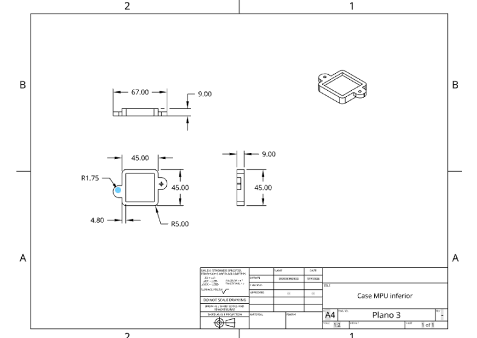
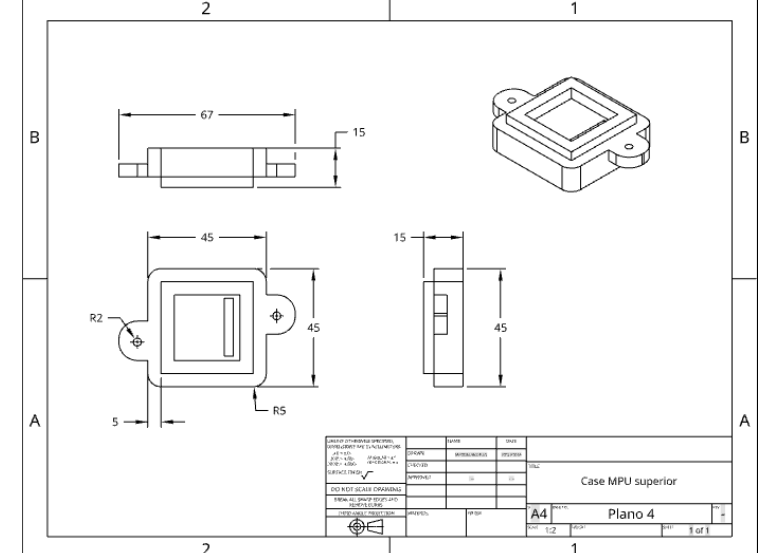
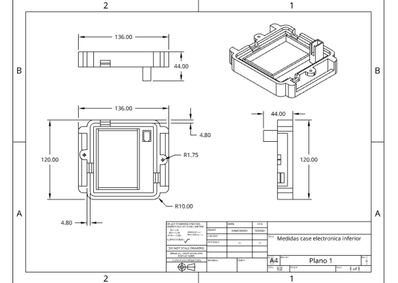
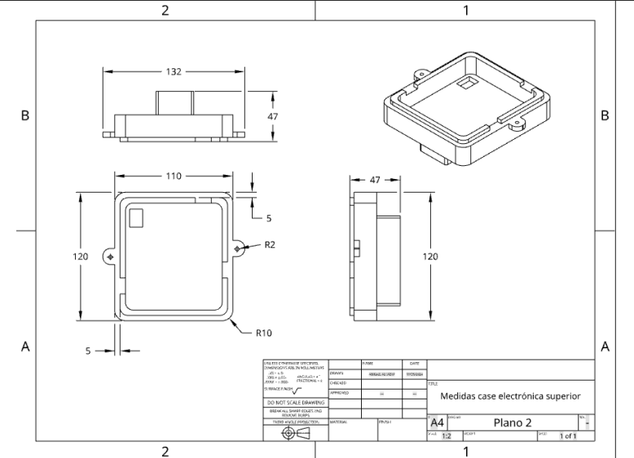
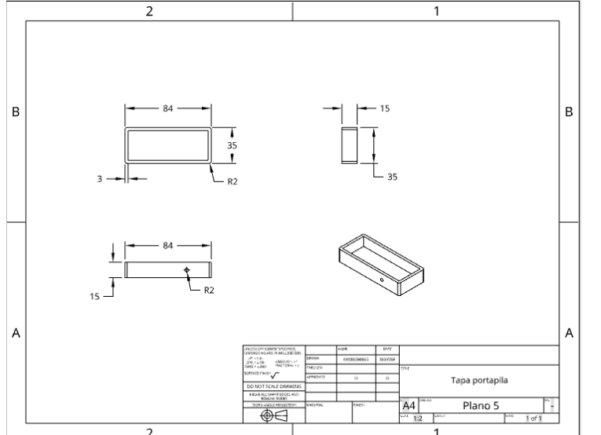
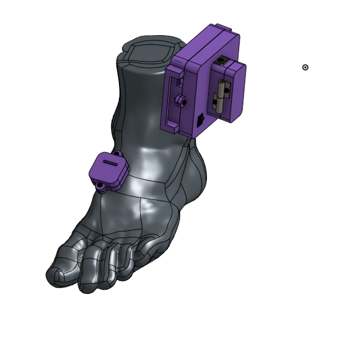
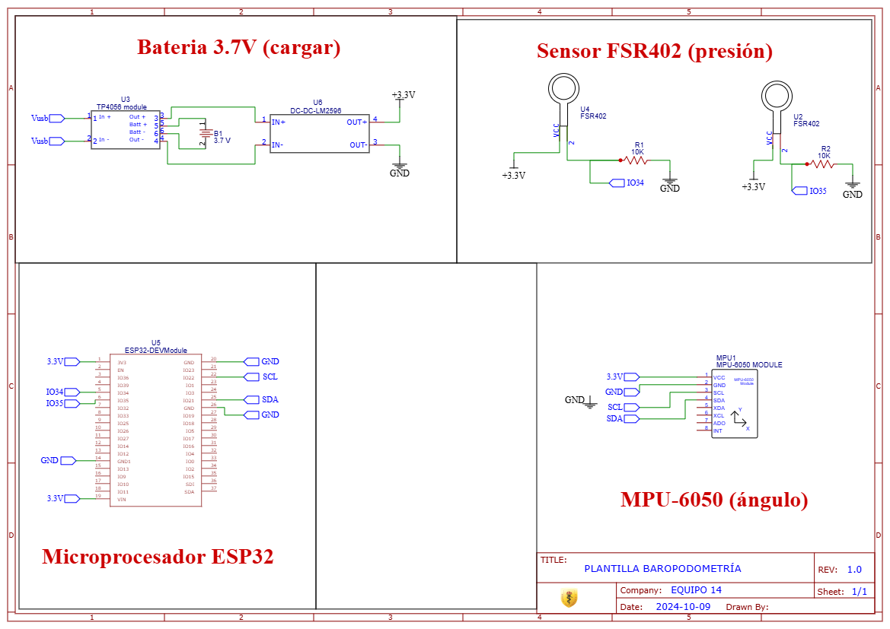

*Planos case MPU superior e inferior:*

*Planos para el case de los demás componentes electrónicos:*

*Plano para case del portapila:*

*Ensamble:*

ONESHOPE:
[https://cad.onshape.com/documents/b59706230b3147a766a9d8ca/w/d9faae820f9fd83e4ae611a1/e/5ab465d6ad715a8f3c73b799](https://cad.onshape.com/documents/b59706230b3147a766a9d8ca/w/d9faae820f9fd83e4ae611a1/e/5ab465d6ad715a8f3c73b799)

*Esquema Electrónico *

